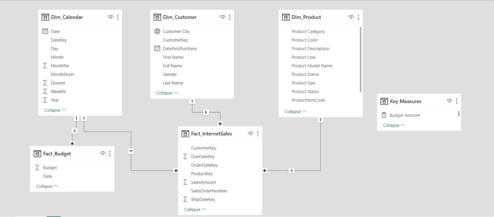

# InsightCraft-Unveiling-Data-Narratives-for-Informed-Decisions
Hey there! I'm all about turning data into stories that help businesses thrive. Check out my projects ranging from unraveling tricky datasets to snazzy trend charts. Let's chat data and make smarter moves together! 📊🚀

## Sales Report Analysis
This project focuses on analyzing sales reports by leveraging calendar details, customer information, product data, and internet sales data. The analysis is performed using Power BI, where data from Excel tables is connected, transformed, and visualized to provide meaningful insights into sales trends and patterns.

### Table of Contents
- Introduction
- Steps
  - Data Sources
  - Loading Data
  - Defining Relationships
  - Creating Interactive Reports
- Getting Started
- Installation
- Usage
- Contributing
  
### Introduction
Sales analysis is essential for any business to understand customer behavior, track product performance, and identify growth opportunities. This project demonstrates how to extract insights from sales data by combining calendar details, customer information, and product data. The analysis is visualized using Power BI, providing interactive reports for better decision-making.
### Steps

#### Data Sources
The project leverages two datasets located within the "Datasets" folder. Subsequently, SQL queries are executed on these datasets, and the resulting outputs are stored in Excel format.

#### Excel Tables:
Available in SQL/SQL Output folder.
- Calendar Details
- Customer Details
- Product Details
- Internet Sales
#### SQL Queries:
Available in SQL/SQL Queries folder.
#### Loading Data
1. Load the Excel tables (Calendar, Customer, Product, Internet Sales) into Power BI.
2. Utilize SQL queries from the SQL folder to extract relevant sales budget data.
#### Defining Relationships
1. Define relationships between tables based on common keys (e.g., product key, customer ID, etc.).
2. Ensure that relationships are correctly established to enable meaningful data connections.

#### Creating Interactive Reports
1. Design reports by selecting appropriate visualizations (charts, graphs, tables, etc.).
2. Utilize calendar details to enable time-based analysis (e.g., sales trends by week, month, quarter).
3. Visualize customer data to identify top customers, gender distribution, and purchase history.
4. Showcase product performance using visualizations that highlight product categories, colors, and sizes.
5. Present internet sales data with insights into order dates, due dates, shipping, and customer segments.
6. Compare present sales and budget with last 2 years.
### Getting Started
Before you begin, ensure you have the following:

- Power BI Desktop installed on your machine.
- Excel tables (Calendar, Customer, Product, Internet Sales) and SQL queries (Sales Budget) available.
#### Installation
1. Clone or download the repository.
2. Open Power BI Desktop.
3. Load the Excel tables and use the provided SQL queries to import the required data.
#### Usage
1. Define relationships between tables as outlined in the project steps.
2. Create reports by selecting visualizations that best convey insights.
3. Leverage time-based analysis, customer data, and product details for deeper insights.
4. Share the interactive reports with your team to drive data-driven decision-making.
### Contributing
Contributions are welcome! Feel free to open issues or submit pull requests for enhancements or fixes.
